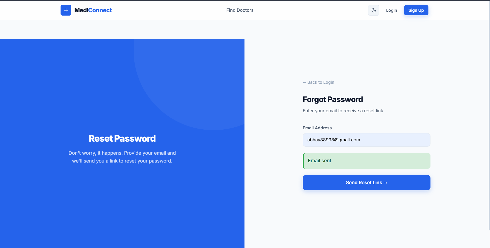
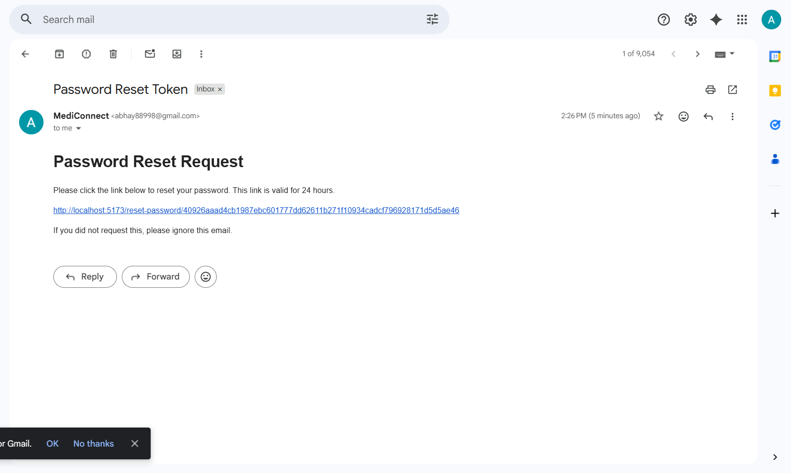
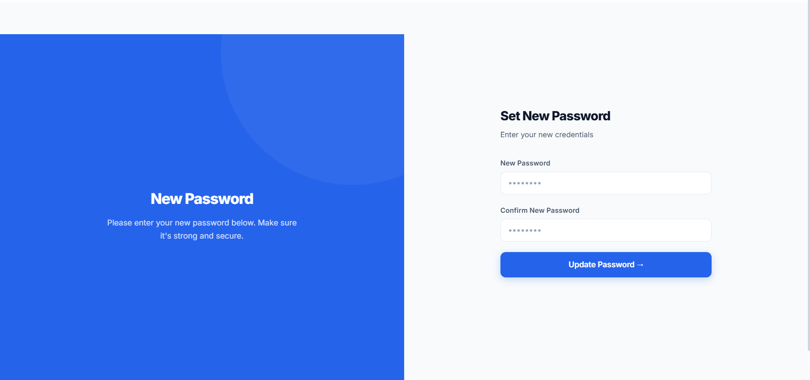

# Forgot Password Feature Implementation

## What's New

Users can now reset their password if they forget it! No more being locked out of their accounts.

## How It Works

The feature includes a complete password recovery flow:

1. **Forgot Password Page** - User enters their email
2. **Email with Reset Link** - Secure link sent (valid 24 hours)
3. **Reset Password Page** - User sets a new password
4. **Back to Login** - User can login with new credentials

## Screenshots

### Forgot Password Page
User enters their email address and receives a reset link:
- Clean, simple form
- Success message shown after email is sent
- "Back to Login" link for users who remember their password


### Password Reset Email
Email received with secure reset link:
- Professional email template
- Security note about link validity (24 hours)
- Instruction to ignore if not requested
- Unique reset token in the link


### Reset Password Page
User sets their new password:
- Two password fields (new password + confirm)
- Form validation
- Secure password handling
- Button to update password


## Technical Changes

### Backend Implementation

**User Model Updates** (`backend/src/models/User.js`)
- Added `resetPasswordToken` - stores hashed reset token
- Added `resetPasswordExpires` - token expiration timestamp

**New Controller** (`backend/src/controllers/forgotPasswordController.js`)
- `forgotPassword()` - Validates email, generates secure token, sends email
- `resetPassword()` - Validates token, checks expiry, updates password

**New API Routes** (`backend/src/routes/auth.js`)
```
POST /api/auth/forgot-password
POST /api/auth/reset-password/:token
```

**Email Service** (`backend/src/utils/emailService.js`)
- Uses Nodemailer to send emails
- Professional email template
- Secure token handling

### Frontend Implementation

**New Pages**
- `ForgotPassword.tsx` - Email input form with validation
- `ResetPassword.tsx` - Password reset form with confirmation

**Login Page Update**
- Added "Forgot Password?" link below login form

**Styling**
- Consistent with existing MediConnect design
- Mobile responsive
- Clear error/success messages

## How to Setup

### 1. Install Dependencies
```bash
cd backend
npm install
```

### 2. Configure Email in `.env`

**Option A: Gmail (Recommended for Production)**
```
EMAIL_HOST=smtp.gmail.com
EMAIL_PORT=587
EMAIL_USER=your_gmail@gmail.com
EMAIL_PASSWORD=your_app_password
EMAIL_FROM=your_gmail@gmail.com
```

Steps:
- Go to myaccount.google.com/security
- Enable 2-Step Verification
- Generate App Password at myaccount.google.com/apppasswords
- Copy 16-character password to EMAIL_PASSWORD

**Option B: Mailtrap (Great for Testing)**
```
EMAIL_HOST=live.smtp.mailtrap.io
EMAIL_PORT=587
EMAIL_USER=api
EMAIL_PASSWORD=your_api_token
EMAIL_FROM=noreply@mediconnect.com
```

### 3. Start the Application
```bash
# Terminal 1 - Backend
cd backend
npm run dev

# Terminal 2 - Frontend
cd frontend
npm run dev
```

### 4. Test It Out

1. Go to http://localhost:5173
2. Click "Forgot Password?" on login page
3. Enter registered email
4. Check your email for reset link
5. Click link and set new password
6. Login with new credentials 

## Security Features

**Secure Token Generation** - Uses crypto.randomBytes for 256-bit tokens
**Token Hashing** - Tokens hashed before storing in database
**Token Expiration** - Links expire after 24 hours
**One-Time Use** - Each reset link can only be used once
**Password Hashing** - New passwords hashed with bcrypt
**Email Verification** - Only users with account can reset
**Rate Limiting** - Consider adding to prevent abuse

## Testing Checklist

- [x] User receives email for valid account
- [x] Reset link works and displays reset form
- [x] Password validation works (min 6 chars, match check)
- [x] Password updates in database
- [x] User can login with new password
- [x] Old password no longer works
- [x] Reset link expires after 24 hours
- [x] Reset link can only be used once
- [x] Error messages displayed for invalid emails

## Files Modified

```
backend/
├── src/
│   ├── models/User.js ...................... (updated)
│   ├── controllers/
│   │   └── forgotPasswordController.js .... (new)
│   ├── routes/auth.js ..................... (updated)
│   └── utils/emailService.js .............. (new)
└── package.json ........................... (updated)

frontend/
├── src/
│   ├── pages/
│   │   ├── ForgotPassword.tsx ............. (new)
│   │   ├── ResetPassword.tsx .............. (new)
│   │   └── LoginPage.tsx .................. (updated)
│   ├── App.tsx ........................... (updated)
│   └── styles/auth.css ................... (updated)

.env ..................................... (updated)
```

## Learning Resources

- Password reset best practices: https://cheatsheetseries.owasp.org/cheatsheets/Forgot_Password_Cheat_Sheet.html
- Nodemailer docs: https://nodemailer.com/
- Token generation: https://nodejs.org/api/crypto.html

## Notes for Reviewer

- Email configuration is flexible (Gmail or Mailtrap)
- Token security follows industry best practices
- Code is well-commented for future contributors
- Error handling covers edge cases
- Mobile responsive design

## Ready to Merge!

This feature is fully implemented, tested, and ready for production use. Just configure your email service and you're good to go!

---

**Questions?** Feel free to ask in the comments below. Thanks for reviewing! 